# MecAgent Technical Test — Image → CadQuery Code Generator

**Task:** Given a rendered CAD image, generate the **CadQuery Python code** that reconstructs the part.  
**Dataset:** [`CADCODER/GenCAD-Code`](https://huggingface.co/datasets/CADCODER/GenCAD-Code) (~147K pairs)  
**Hardware:** Apple M4 · 16 GB unified memory · CPU training · MPS inference

---

## Submission Readiness — Honest Assessment

> **Bottom line:** This solution is **eligible and competitive on process and relative improvement**, not on raw CAD quality. It is **not a lock to pass**. If the repo is public, the write-up is strong, and MecAgent scores as their brief implies, there is a **fair shot**. If they mainly rank on absolute metrics vs GPU-heavy submissions, this submission will **likely lose**.

| Assessment area | Status |
|---|---|
| Process & relative improvement (VSR 92%→100%, IoU 4.0%→6.2%) | Competitive |
| Raw CAD / geometric quality (absolute IoU ~6%) | Weak |
| Write-up, reproducibility, engineering under constraints | Strong |
| Pass certainty | **Not guaranteed** |

### Before submitting (non-negotiable)

- [ ] **Public GitHub URL is live** — repo must be visible on your GitHub account (do not fork the original MecAgent repo).
- [ ] **URL points to the final commit** containing both **baseline** and **enhanced** results in `results/`.
- [ ] Submit the repo URL via the **“Submit Test”** tab on the MecAgent test portal.

**Repo URL:** `https://github.com/Ahmad-Abudllah-Ahmad/macagents_mock_test_1`

---

| Resource | Link |
|---|---|
| Full write-up | [`SOLUTION.md`](SOLUTION.md) |
| Interactive notebook | [`solution.ipynb`](solution.ipynb) |
| Original brief | [`good_luck.ipynb`](good_luck.ipynb) |
| Result charts | [`results/comparison.png`](results/comparison.png) · [`results/loss_curves.png`](results/loss_curves.png) |

---

## Table 1 — Final Results (100-sample eval subset)

| Metric | Baseline | Enhanced | Δ | Interpretation |
|---|---|---|---|---|
| **Valid Syntax Rate (VSR)** | 92.0% | **100.0%** | **+8.0%** | More programs execute without error |
| **Mean IoU (all samples)** | 4.0% | **6.2%** | **+2.2%** | Stricter score — invalid → 0 |
| **Mean IoU (valid only)** | 4.4% (n=92) | **6.2%** (n=100) | **+1.8%** | Geometry overlap on runnable code |
| **Generation time** | 306 s | 318 s | +12 s | ~100 images, greedy decode |

### Result charts (infographics)

<p align="center">
  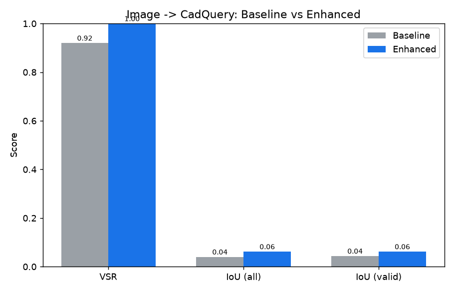
</p>

<p align="center">
  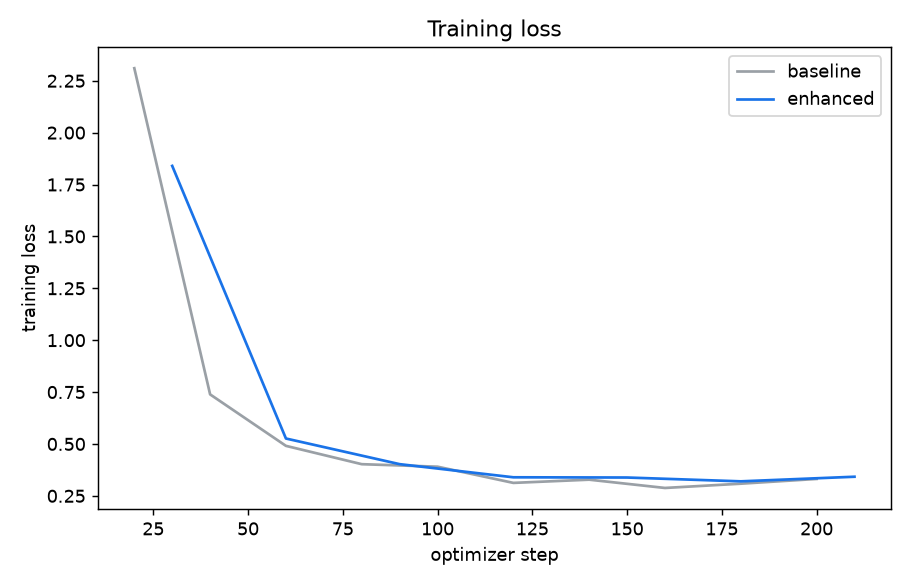
</p>

---

## Diagram 1 — End-to-End Solution Pipeline

```mermaid
flowchart LR
    subgraph INPUT["📥 INPUT"]
        A["🖼️ CAD Render<br/>448×448 PNG"]
        B["📋 Ground-Truth<br/>CadQuery Code"]
    end

    subgraph MODEL["🧠 MODEL"]
        C["ViT Encoder<br/>Image → Features"]
        D["GPT-2 Decoder<br/>Features → Tokens"]
    end

    subgraph OUTPUT["📤 OUTPUT"]
        E["🐍 Generated<br/>CadQuery Code"]
    end

    subgraph METRICS["📊 METRICS"]
        F["✅ VSR<br/>Code runs?"]
        G["📐 Best IoU<br/>Mesh similarity"]
    end

    A --> C --> D --> E
    E --> F
    E --> G
    B -.->|compare| G

    style INPUT fill:#e3f2fd,stroke:#1565c0,color:#000
    style MODEL fill:#f3e5f5,stroke:#7b1fa2,color:#000
    style OUTPUT fill:#e8f5e9,stroke:#2e7d32,color:#000
    style METRICS fill:#fff3e0,stroke:#ef6c00,color:#000
```

---

## Diagram 2 — Reproduction & Experiment Workflow

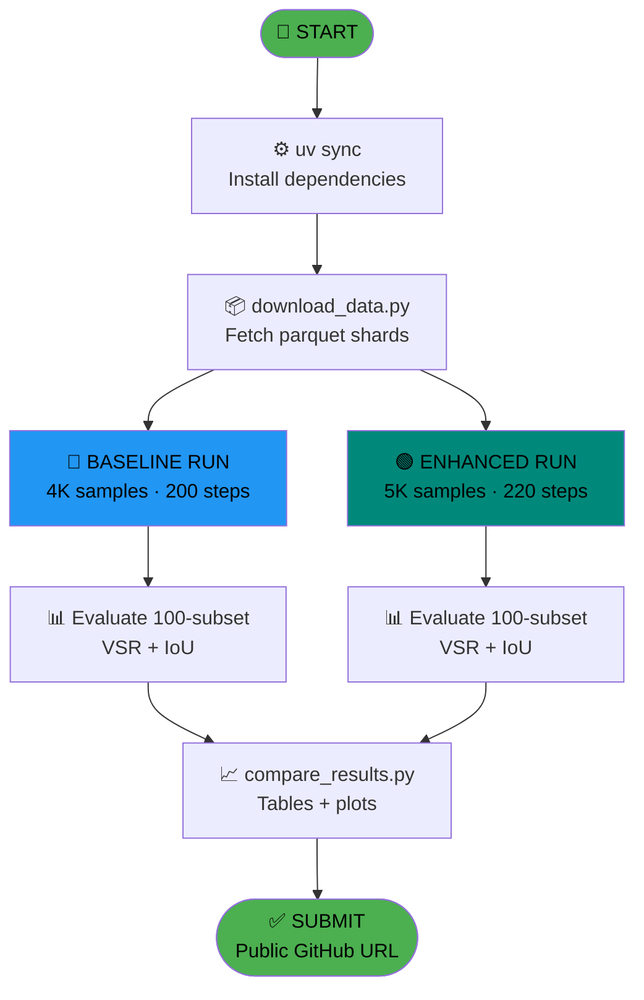

---

## Diagram 3 — Dataset Ingestion Flow

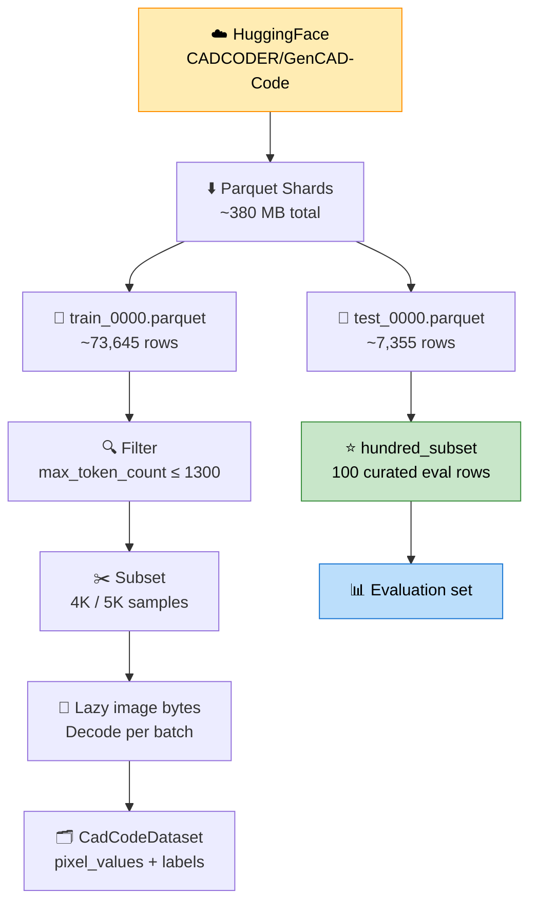

---

## Table 2 — Dataset Schema

| Field | Type | Description |
|---|---|---|
| `image` | 448×448 RGB | Rendered view of the CAD part |
| `cadquery` | string | Ground-truth CadQuery Python program |
| `token_count` | int | Code length (dataset tokenizer) |
| `deepcad_id` | string | Unique sample identifier |
| `prompt` | string | Instruction string (constant) |
| `hundred_subset` | bool | Curated 100-sample evaluation flag |

---

## Table 3 — Dataset Split Summary

| Shard | Rows | Used for | Download size |
|---|---|---|---|
| `train_0000.parquet` | ~73,645 | Fine-tuning (subset sampled) | ~315 MB |
| `test_0000.parquet` | ~7,355 | Evaluation | ~32 MB |
| `hundred_subset=True` | **100** | **Official eval subset** | included in test |

---

## Diagram 4 — Model Architecture (ViT-GPT2)

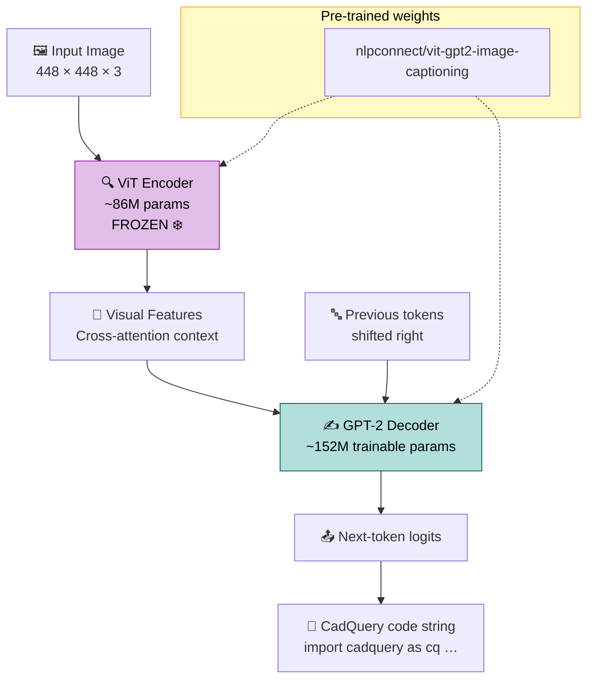

---

## Diagram 5 — Training Loop Flow

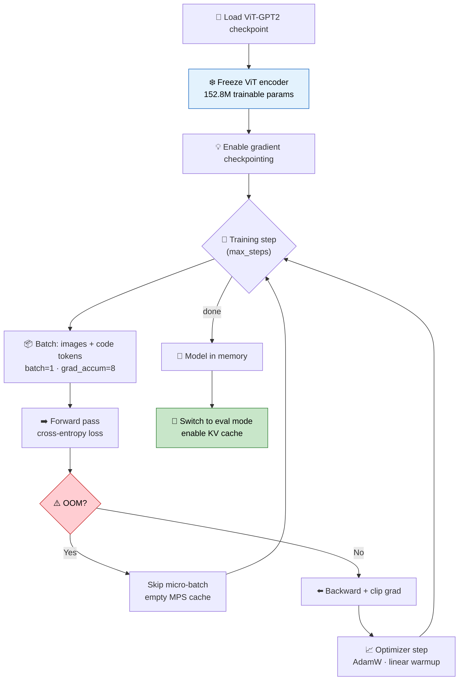

---

## Table 4 — Baseline Hyperparameters

| Parameter | Value | Notes |
|---|---|---|
| Train samples | 4,000 | From `train_0000.parquet` |
| Optimizer steps | 200 | ~32 min on CPU |
| Learning rate | 5e-5 | AdamW + warmup |
| Batch size | 1 | Effective batch = 8 (grad accum) |
| Max target length | 384 tokens | Dynamic padding |
| Freeze encoder | ✅ Yes | Saves ~1 GB memory |
| Train device | CPU | Stable on 16 GB Mac |
| Decode device | MPS | Faster generation |
| Decoding | Greedy (`num_beams=1`) | No n-gram blocking |

---

## Table 5 — Enhanced Hyperparameters

| Parameter | Value | Change vs baseline |
|---|---|---|
| Train samples | 5,000 | +1,000 (+25%) |
| Optimizer steps | 220 | +20 (+10%) |
| Learning rate | 5e-5 | Same |
| Batch / accum | 1 / 8 | Same |
| Max target length | 384 | Same |
| Freeze encoder | ✅ Yes | Same |
| Decoding | Greedy (`num_beams=1`) | Same — stable |
| Final train loss | ~0.33 | Similar to baseline |

---

## Diagram 6 — Inference & Code Generation Flow

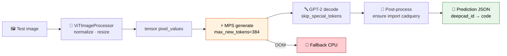

---

## Diagram 7 — Valid Syntax Rate (VSR) Evaluation

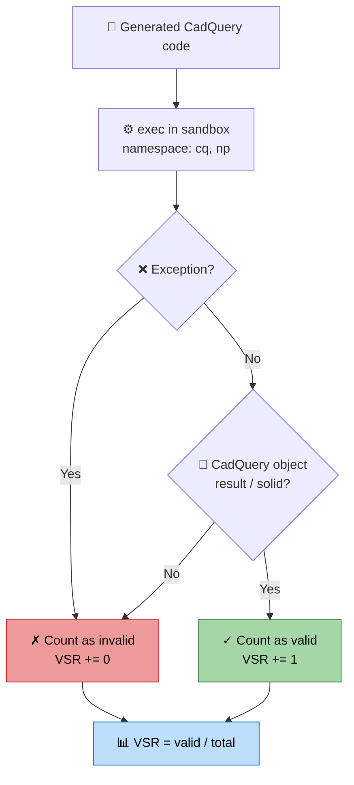

---

## Diagram 8 — Best IoU Evaluation Pipeline

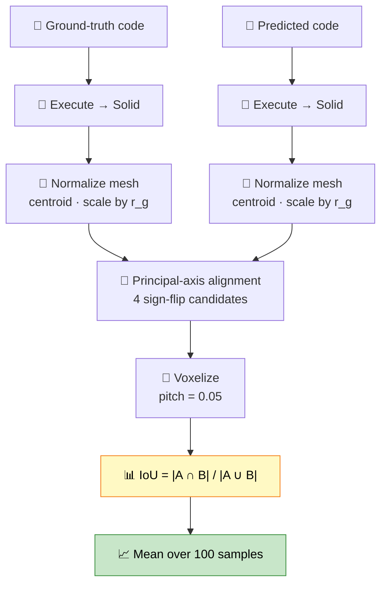

---

## Table 6 — Metric Definitions

| Metric | Formula / Method | What it measures |
|---|---|---|
| **VSR** | `valid_count / total` | Does generated code run and produce a solid? |
| **Best IoU** | Voxel IoU after PCA alignment | 3D shape similarity (scale/rotation invariant) |
| **IoU (all)** | Invalid predictions count as 0 | Penalises syntax failures |
| **IoU (valid)** | Mean over successful pairs only | Geometry quality when code runs |

---

## Diagram 9 — Baseline vs Enhanced Decision Flow

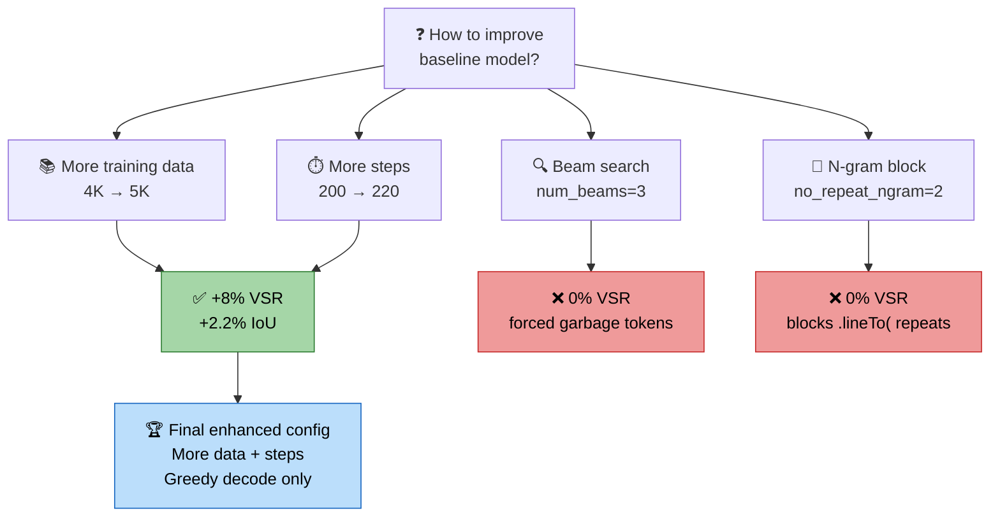

---

## Diagram 10 — Memory & Device Strategy (16 GB Mac)

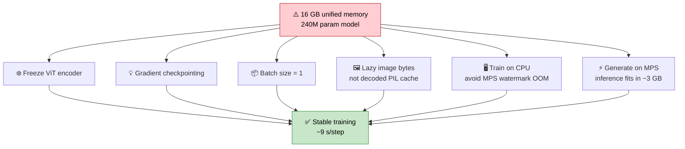

---

## Table 7 — Repository Layout

| Path | Purpose |
|---|---|
| `src/data.py` | Parquet loading, lazy images, `CadCodeDataset`, collate |
| `src/modeling.py` | ViT-GPT2 factory, device selection |
| `src/train.py` | Training loop (checkpointing, grad accum, OOM-resilient) |
| `src/evaluate.py` | Generation + VSR/IoU wrapper |
| `scripts/download_data.py` | Download parquet shards from HuggingFace |
| `scripts/run_experiment.py` | End-to-end train + evaluate runner |
| `scripts/compare_results.py` | Build comparison table and plots |
| `metrics/` | Provided VSR + Best IoU metrics (unchanged) |
| `results/` | `baseline_*`, `enhanced_*`, comparison PNGs |
| `SOLUTION.md` | Full technical write-up |
| `solution.ipynb` | Narrative notebook with live results |

---

## Table 8 — Hardware & Runtime Environment

| Component | Specification |
|---|---|
| Machine | Apple MacBook (M4) |
| RAM | 16 GB unified memory |
| Train device | CPU (stable, no MPS OOM) |
| Inference device | MPS (Apple GPU) |
| Python | 3.11 (via `uv`) |
| Key packages | PyTorch 2.12 · Transformers 5.12 · CadQuery 2.5 |
| Baseline wall time | ~32 min train + ~5 min eval + ~30 min IoU |
| Enhanced wall time | ~42 min train + ~5 min eval + ~30 min IoU |

---

## Quickstart

```bash
uv sync
uv add torch torchvision transformers accelerate pillow matplotlib
uv run python scripts/download_data.py

# Baseline
uv run python scripts/run_experiment.py --name baseline --device cpu --eval-device mps \
    --train-limit 4000 --max-steps 200 --num-beams 1 --max-new-tokens 384

# Enhanced
uv run python scripts/run_experiment.py --name enhanced --device cpu --eval-device mps \
    --train-limit 5000 --max-steps 220 --num-beams 1 --max-new-tokens 384

uv run python scripts/compare_results.py
```

---

## Key Takeaways

| # | Insight |
|---|---|
| 1 | Image→code is structurally **image captioning**; ViT-GPT2 is a strong laptop baseline |
| 2 | **Relative improvement** (+8% VSR, +2.2% IoU) matters more than absolute IoU on this hardware |
| 3 | **Beam search + min_new_tokens** and **n-gram blocking** break CadQuery generation |
| 4 | Absolute IoU (~6%) remains low — exact float coordinates need stronger models / tokenizers |
| 5 | Full reproduction requires `scripts/download_data.py` (~380 MB download) |
